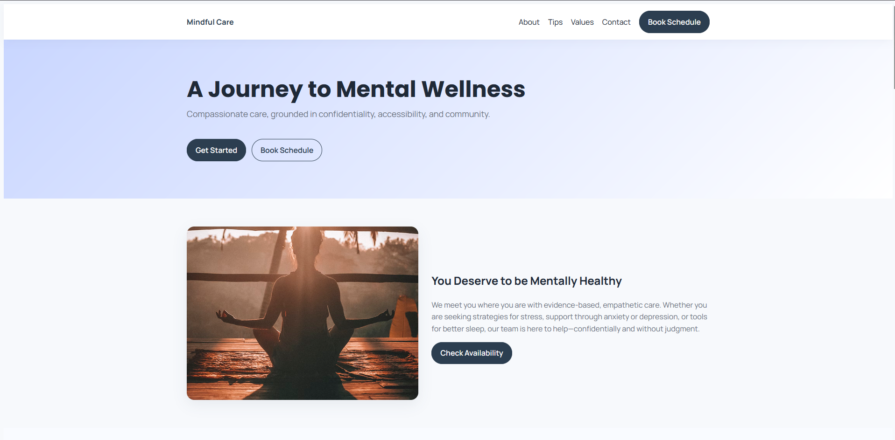
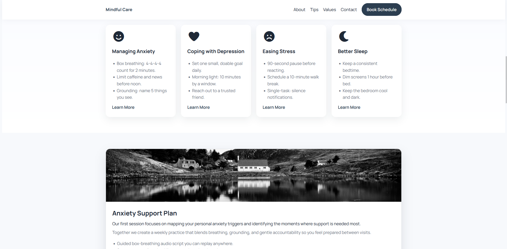
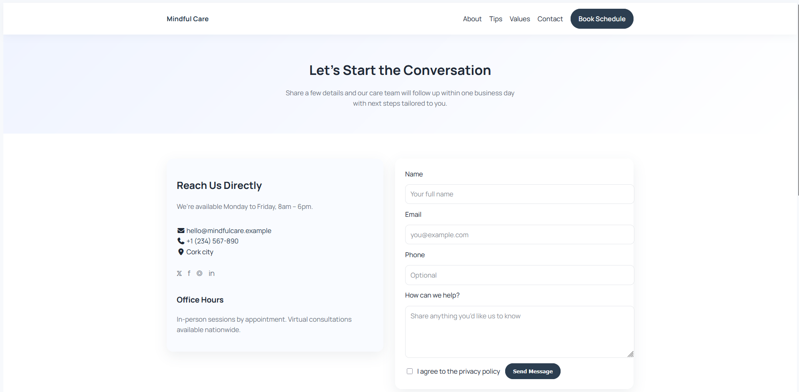

## Mindful Care Clinic — Single-Page Experience

Mindful Care Clinic is a responsive single-page site designed to help prospective clients quickly understand the clinic’s services, values, and ways to get in touch. The layout guides visitors from a welcoming hero, through introductory guidance, to detailed resource cards and a contact form that converts interest into action.

### Table of contents
1. [Why it matters](#why-it-matters)
2. [Highlights](#highlights)
3. [Site walkthrough](#site-walkthrough)
4. [Screenshots](#screenshots)
5. [Run it locally](#run-it-locally)
6. [Deploy it](#deploy-it)
7. [Tech stack](#tech-stack)
8. [Accessibility & performance considerations](#accessibility--performance-considerations)
9. [Attributions](#attributions)

### Why it matters
- **Prospective clients** get calming guidance, practical next steps, and clear booking paths in one scrollable experience.
- **Clinic staff** gain an always-on marketing presence that highlights expertise, builds trust, and collects high-quality inquiries.

### Site walkthrough
- **Hero + navigation** — Provides a confident brand entry point, prioritized calls to action (“Get Started”, “Book Schedule”), and sticky navigation for quick jumps.
- **About section** — Pairs an inviting photo with supporting copy so visitors know who the clinic serves and how support is delivered.
- **First Treatment Tips** — Offers actionable micro-advice for anxiety, depression, stress, and sleep; each “Learn More” link deepens the narrative via the detailed cards below.
- **Detailed cards** — Translate tips into session outcomes so users understand what working with the clinic actually looks like.
- **Values + Contact** — Reinforces trust (confidentiality, accessibility, community) and closes with a frictionless contact form and consent acknowledgement.

### Highlights
- Sticky navigation with smooth in-page anchors for fast access to each section.
- “First Treatment Tips” grid with quick wins that segue into deeper resource cards.
- Detailed cards (Anxiety, Depression, Stress, Sleep) that explain what to expect in session and link to contact points.
- Core values and contact sections that reinforce credibility and make conversion straightforward.

### Screenshots

| View | Description | User value |
| --- | --- | --- |
|  | Hero section with headline, CTA buttons, and sticky navigation. | Helps visitors orient instantly and choose a path (tips vs. booking). |
|  | Tips grid and corresponding detailed resource cards. | Bridges immediate self-help guidance with richer program descriptions. |
|  | Contact panel and form with consent checkbox. | Makes it easy to reach the clinic while reinforcing privacy and responsiveness. |

### Run it locally
1. Clone or download this repository.
2. Open `index.html` in your browser **or** serve the folder with any static server.
3. Browse the anchored sections to confirm smooth scrolling and sticky navigation behavior.

### Deploy it
- **GitHub Pages**
	1. Push the project to a public GitHub repository.
	2. In **Settings → Pages**, point to the `main` branch and `/ (root)` folder.
	3. Wait for the action to finish; the site appears at `https://<username>.github.io/<repo>/`.

### Tech stack
- Semantic **HTML5** for structure, **CSS** modules (`general.css`, `header.css`, `main.css`, `contact.css`) for styling, and a tiny vanilla **JavaScript** file for smooth scrolling and mobile nav toggle.
- Typography via Google Fonts (`Manrope`, `Poppins`, `Open Sans`).
- Icons provided through Font Awesome kit `7babdebb89.js`.

### Accessibility & performance considerations
- Section IDs plus `scroll-margin-top` keep anchors visible below the sticky nav.
- Forms include labels, placeholders, and a required privacy consent checkbox.
- Imagery should be optimized (WebP/JPEG) and described with meaningful `alt` text for assistive tech.

### Attributions
- Font Awesome icons courtesy of [Font Awesome](https://fontawesome.com/) (kit `7babdebb89.js`).
- Google Fonts served via `fonts.googleapis.com` for Manrope, Open Sans, and Poppins.
- Smooth scroll and nav toggle logic under `assets/JavaScript/script.js` is custom-written for this project.

